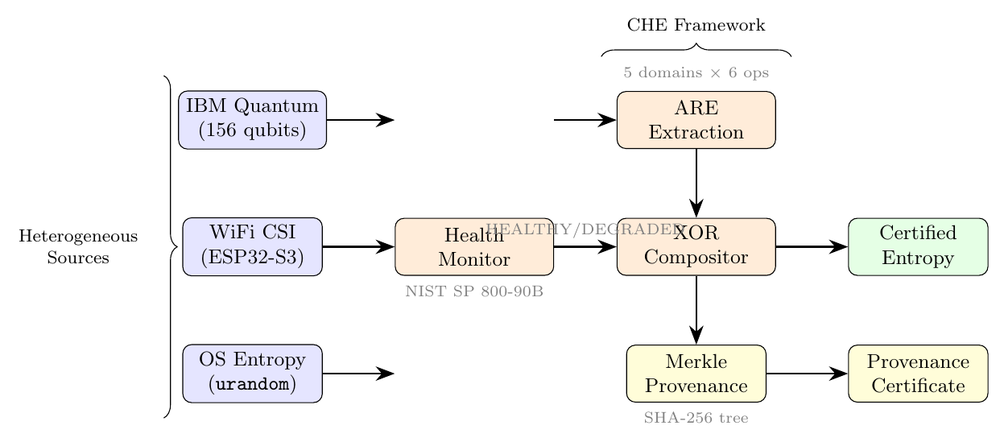
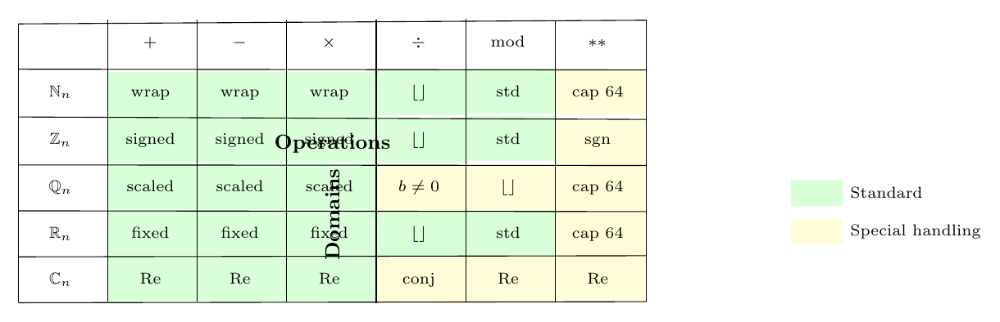
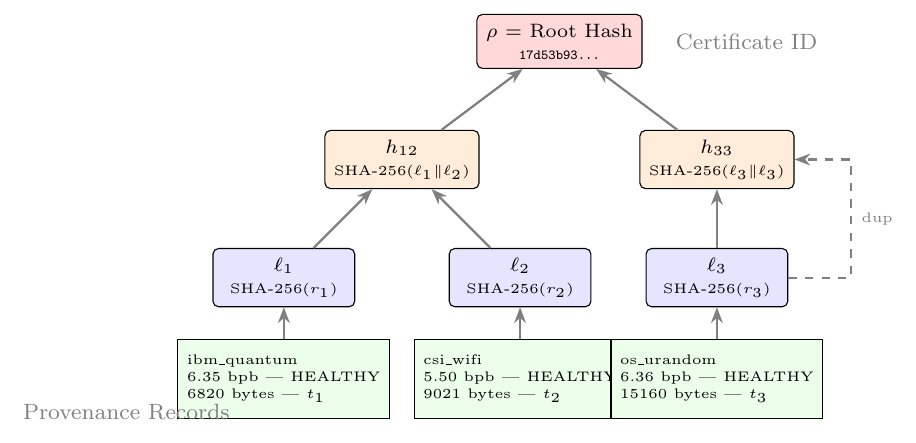
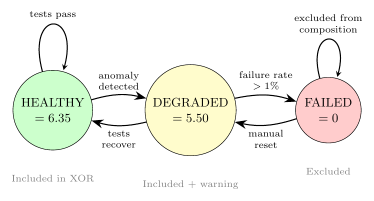
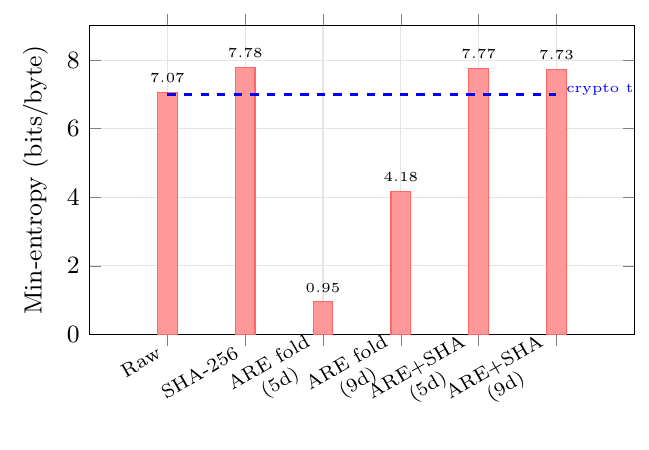
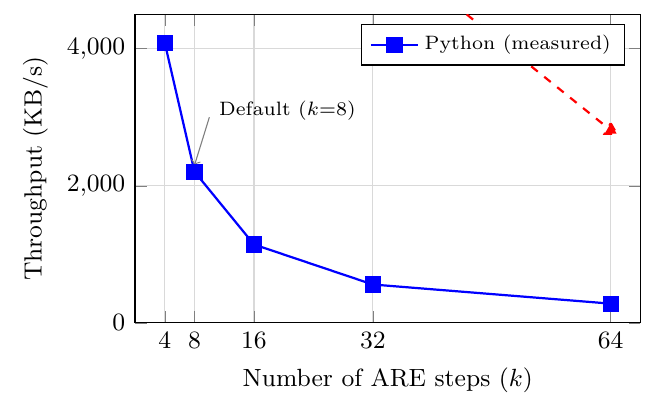

<p align="center">
  <h1 align="center">Certified Heterogeneous Entropy with Algebraic Randomness Extraction</h1>
</p>

<p align="center">
  <a href="https://github.com/QDaria/certified-heterogeneous-entropy/blob/main/main.pdf"></a>
  <a href="https://pypi.org/project/zipminator/"></a>
  <a href="https://github.com/QDaria/certified-heterogeneous-entropy/blob/main/LICENSE"></a>
  <a href="https://orcid.org/0009-0008-2270-5454"></a>
  
  
  
  <a href="https://doi.org/10.5281/zenodo.19437014"></a>
</p>

---

**Daniel Mo Houshmand**
[QDaria Quantum Research](https://qdaria.com), Oslo, Norway

## Abstract

Composing entropy from heterogeneous sources (quantum hardware, WiFi CSI, and OS random number generators) is essential for post-quantum cryptographic systems but lacks formal provenance guarantees. We present the **Certified Heterogeneous Entropy (CHE)** framework, which makes three contributions:

1. **Algebraic Randomness Extraction (ARE)**: a new family of seeded extractors parameterized by algebraic programs over nine number domains (N, Z, Q, R, C, quaternions H, octonions O, GF(p^n), p-adic numbers), generated deterministically from SHAKE-256.

2. **Certified composition protocol**: XOR-fuses entropy from multiple independent sources while constructing **Merkle-tree provenance certificates** proving per-source contribution.

3. **Graceful degradation**: maintains accurate min-entropy bounds without silent fallback when individual sources fail.

Our implementation processes **6.8 MB of IBM Quantum entropy** (156 qubits), WiFi CSI entropy from ESP32-S3 hardware, and OS entropy through the ARE extractor and compositor pipeline. NIST SP 800-90B testing validates output quality. The provenance certificates provide a complete audit trail satisfying **DORA Art. 7** requirements for cryptographic key lifecycle management in EU-regulated financial institutions.

## Key Contributions

| # | Contribution | Formal Result |
|---|---|---|
| 1 | ARE extractors over 9 algebraic domains | Definition 3, Algorithm 1 |
| 2 | GF-domain min-entropy preservation | Theorem 2 (bijection proof) |
| 3 | Merkle-tree provenance certificates | Section 5, Algorithm 2 |
| 4 | Graceful degradation with min-entropy bounds | Theorem 4 |
| 5 | DORA Art. 7 compliance for EU financial institutions | Section 8 |
| 6 | Two-layer defense-in-depth extraction | Algebraic fold + SHA-256 expansion |

## Figures

<table>
<tr>
<td width="50%">

**Fig. 1: CHE System Architecture**

*Three heterogeneous entropy sources feed through ARE extraction, XOR composition, and Merkle provenance certification.*

</td>
<td width="50%">

**Fig. 2: ARE Domain-Operation Matrix**

*Green cells use standard arithmetic; yellow cells require domain-specific operations (quaternion/octonion multiplication, GF exponentiation).*

</td>
</tr>
<tr>
<td width="50%">

**Fig. 4: Merkle-Tree Provenance Certificate**

*Cryptographic proof of per-source entropy contribution for three-source composition.*

</td>
<td width="50%">

**Fig. 5: Health Monitoring State Machine**

*Sources transition between Healthy, Degraded, and Failed states with min-entropy bound updates.*

</td>
</tr>
<tr>
<td width="50%">

**Fig. 7: Extractor Comparison**

*Min-entropy comparison across extraction methods on the heterogeneous test corpus.*

</td>
<td width="50%">

**Fig. 8: ARE Throughput**

*ARE throughput vs. step count (Python, 8 KB input blocks).*

</td>
</tr>
</table>

> All 10 figures available in [`figures/`](figures/) (PDF + TikZ source) and [`images/`](images/) (PNG).

## Paper Structure

| Section | Title | Content |
|---------|-------|---------|
| 1 | Introduction | Heterogeneous entropy problem, provenance gap |
| 2 | Preliminaries | Min-entropy, seeded extractors, NIST SP 800-90B |
| 3 | ARE Construction | 9 domains, SHAKE-256 program generation, Algorithm 1 |
| 4 | GF-Domain Analysis | Bijection theorem, per-step uniformity proof |
| 5 | Certified Composition | XOR-fusing, Merkle-tree certificates, Algorithm 2 |
| 6 | Health Monitoring | State machine, graceful degradation, Theorem 4 |
| 7 | Evaluation | 6.8 MB quantum + CSI + OS entropy, NIST testing |
| 8 | DORA Compliance | Art. 7, audit trail, EU financial regulation |
| 9 | Comparison | vs. HKDF, Fortuna, NIST SP 800-90A, XOR-only |
| 10 | Discussion | Extended domains, Rust implementation, future work |

## Building the Paper

```bash
pdflatex main.tex
bibtex main
pdflatex main.tex
pdflatex main.tex
```

The pre-compiled PDF is available at [`main.pdf`](main.pdf).

## Implementation

```bash
pip install zipminator[all]
```

```python
from zipminator.entropy import CompositorProvider, AREExtractor

# Three-source composition with provenance
compositor = CompositorProvider(
    sources=["quantum", "csi", "os"],
    extractor=AREExtractor(domains=["GF", "Z", "R"], steps=8),
)
entropy, certificate = compositor.extract_with_provenance(num_bytes=1024)
```

Source: [QDaria/zipminator](https://github.com/QDaria/zipminator) | PyPI: [zipminator](https://pypi.org/project/zipminator/)

## Related Papers

This paper is part of a three-paper series on post-quantum entropy infrastructure:

1. [Quantum-Certified Anonymization](https://github.com/QDaria/quantum-certified-anonymization) - Physics-guaranteed irreversibility via Born rule
2. [Unilateral WiFi CSI as a NIST-Validated Entropy Source](https://github.com/QDaria/unilateral-csi-entropy) - CSI entropy extraction + PUEK
3. **This paper** - Certified Heterogeneous Entropy + ARE

## Patent

Norwegian Patent Application filed April 2026 (Patentstyret). 17 claims covering the CHE framework, ARE construction, and Merkle-tree provenance certificates.

## Citation

```bibtex
@misc{houshmand2026che,
  author       = {Houshmand, Daniel Mo},
  title        = {Certified Heterogeneous Entropy with Algebraic Randomness Extraction},
  year         = {2026},
  doi          = {10.5281/zenodo.19437014},
  url          = {https://doi.org/10.5281/zenodo.19437014},
}
```

## License

[Apache-2.0](LICENSE)
